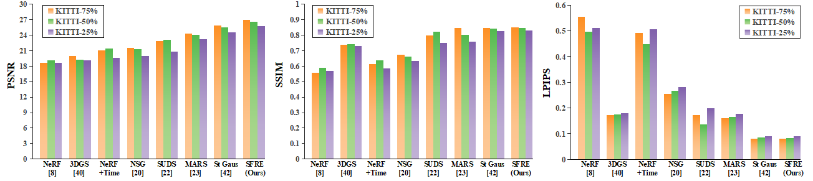
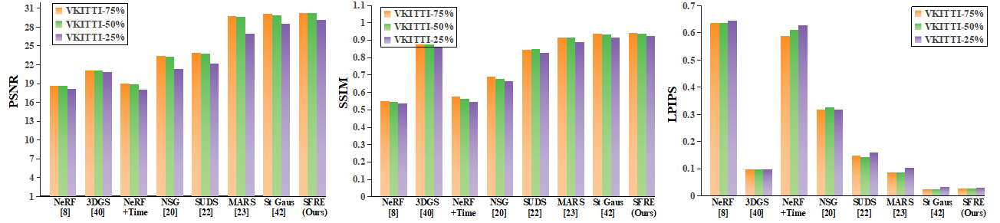

# SFRE
We propose a stable and flexible scene rendering engine (SFRE), which jointly models the static background and dynamic foreground, and enables the controllable editing and synthesis of novel scenes by manipulating the position and yaw angle of dynamic vehicles.

# Project Title

**Stable and Flexible Scene Rendering Engine for Novel Scene Synthesis in Autonomous Driving**

---

## Visualization Results

### Novel View Synthesis

<p align="center">
  
  
</p>

<p align="center">
  <b>(a)</b> Experimental results analysis of Novel View Synthesis on KITTI dataset &nbsp;&nbsp;&nbsp;
  <b>(b)</b> Experimental results analysis of Novel View Synthesis on VKITTI2 dataset.
</p>

---

### Editable Scene Synthesis Results

#### Large-scale Translation of Dynamic Vehicles

<p align="center">
  
</p>

<p align="center">
  <b>Figure 2.</b> Large-scale Translation of Dynamic Vehicles: Row 1 shows the original scene reconstruction; rows 2–3 show medium-distance translations, and rows 4–5 show long-distance translations using our method.
</p>

#### Large Rotation of Dynamic Vehicles Toward Unobserved Directions

<p align="center">
  
</p>

<p align="center">
  <b>Figure 3.</b> Large Rotation of Dynamic Vehicles Toward Unobserved Directions: (a) 60° rotation, (b) 90° rotation, (c) 180° rotation.
</p>

---

## Citation

```bibtex
@article{yourpaper2026,
  title={Your Paper Title},
  author={Author1 and Author2 and Author3},
  journal={Journal Name},
  year={2026}
}
